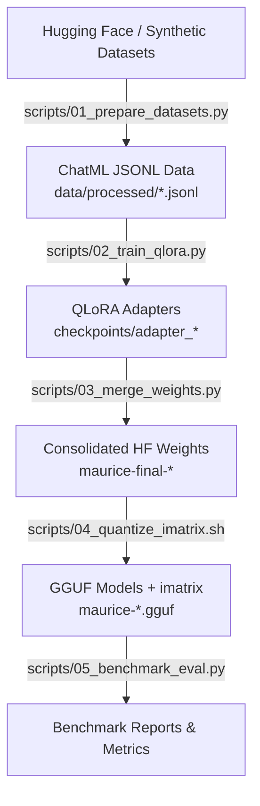
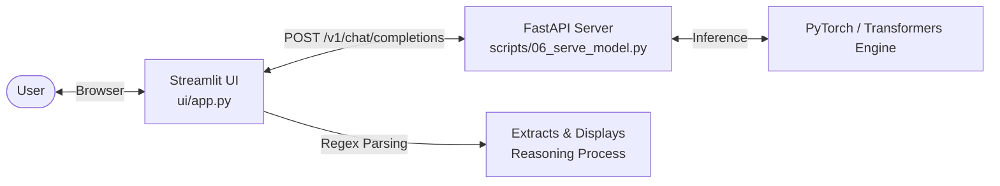
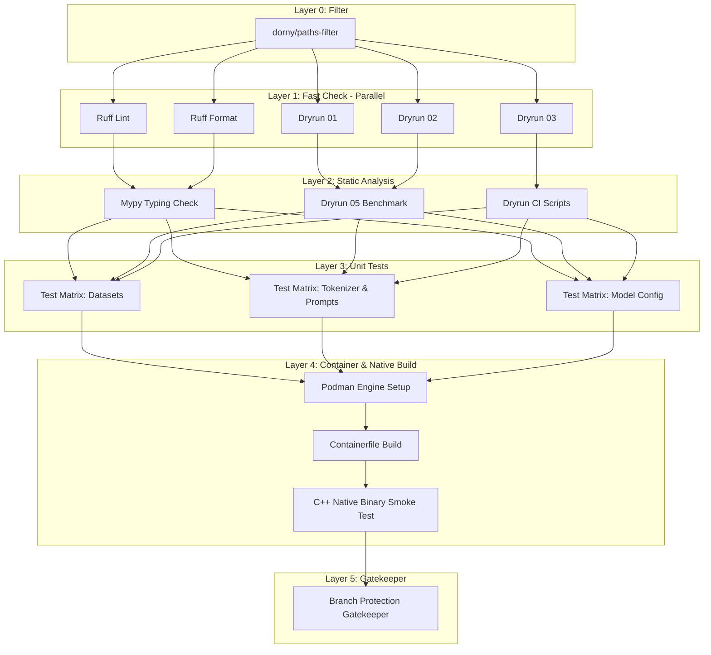

# MAURICE Framework

> **Minimal Adaptation for Ultra-fast Reasoning and Inference in Code Engines**

[](https://github.com/Helfstein-one/MAURICE/actions/workflows/ci.yml)
[](LICENSE)
[](pyproject.toml)
[](https://huggingface.co/deepseek-ai/DeepSeek-R1-Distill-Qwen-1.5B)

MAURICE is an end-to-end framework for automated training, post-training alignment, GGUF quantization with importance matrices (`imatrix`), and local runtime delivery of specialized 1.5B parameter language models based on `deepseek-ai/DeepSeek-R1-Distill-Qwen-1.5B`.

---

## Table of Contents

- [Overview & Architecture](#overview--architecture)
  - [Pipeline Architecture](#pipeline-architecture)
  - [Serving & UI Architecture](#serving--ui-architecture)
  - [CI/CD DAG Topology](#cicd-dag-topology)
- [Model Matrix](#model-matrix)
- [Directory Structure](#directory-structure)
- [Installation & Setup](#installation--setup)
  - [Local Installation (Poetry)](#local-installation-poetry)
  - [Container Installation (Podman / Docker)](#container-installation-podman--docker)
- [Quickstart & Pipeline Execution](#quickstart--pipeline-execution)
  - [Running Individual Pipeline Stages](#running-individual-pipeline-stages)
  - [Automated Pipeline Execution via Makefile](#automated-pipeline-execution-via-makefile)
- [Inference & UI](#inference--ui)
  - [Starting the FastAPI Inference Server](#starting-the-fastapi-inference-server)
  - [Running the Streamlit UI](#running-the-streamlit-ui)
- [Development & Quality Gates](#development--quality-gates)
- [License](#license)

---

## Overview & Architecture

### Pipeline Architecture

The training and quantization workflow flows sequentially from dataset preparation to GGUF quantization and model evaluation:



### Serving & UI Architecture

MAURICE provides an OpenAI-compatible FastAPI backend coupled with an interactive Streamlit UI that parses and highlights chain-of-thought `<think>` blocks:



### CI/CD DAG Topology

The repository utilizes a 6-layer Directed Acyclic Graph (DAG) workflow in GitHub Actions to ensure fast feedback and quality checks:



---

## Model Matrix

| Variant | Variant ID | Base Model | HF Dataset Source | Target Specialization & Key Features |
| :--- | :--- | :--- | :--- | :--- |
| **Code** | `mau-llm-1.0-c` | `DeepSeek-R1-Distill-Qwen-1.5B` | `bigcode/the-stack-smol-xs` | Syntax validation, AST consistency, unified diff patches, structural refactoring |
| **Reasoning** | `mau-llm-1.0-r` | `DeepSeek-R1-Distill-Qwen-1.5B` | `HuggingFaceH4/Bespoke-Stratos-17k` | Step-by-step chain-of-thought reasoning with calibrated `<think>` tags |
| **General** | `mau-llm-1.0-g` | `DeepSeek-R1-Distill-Qwen-1.5B` | `teknium/OpenHermes-2.5` | Instruction-following balance with adaptive thinking suppression |

---

## Directory Structure

```text
maurice/
├── .github/
│   └── workflows/
│       └── ci.yml             # 6-Layer DAG GitHub Actions Workflow
├── .jules/                    # Operational guidelines and agent setup scripts
├── configs/                   # Hyperparameter configurations per model variant
│   ├── variant_c.json
│   ├── variant_r.json
│   └── variant_g.json
├── data/
│   ├── raw/                   # Raw input datasets
│   └── processed/             # Formatted ChatML JSONL training datasets
├── modelfiles/                # Ollama/GGUF Modelfiles with target system prompts
│   ├── Modelfile.c
│   ├── Modelfile.r
│   └── Modelfile.g
├── paper/                     # LaTeX documentation & research papers
│   └── maurice_paper.tex
├── scripts/
│   ├── 01_prepare_datasets.py # Dataset fetching, filtering, and ChatML conversion
│   ├── 02_train_qlora.py        # QLoRA fine-tuning script
│   ├── 03_merge_weights.py      # QLoRA adapter consolidation
│   ├── 04_quantize_imatrix.sh   # GGUF conversion & imatrix quantization script
│   ├── 05_benchmark_eval.py     # Evaluation & performance benchmark suite
│   └── 06_serve_model.py        # OpenAI-compatible FastAPI server
├── tests/                     # Unit test suite (pytest)
├── ui/
│   └── app.py                 # Streamlit reasoning visualization interface
├── Containerfile              # Multi-stage glibc-compatible runtime Containerfile
├── LICENSE                    # MIT License
├── Makefile                   # Orchestration targets for entire workflow
├── pyproject.toml             # Poetry project dependencies & tools configuration
└── README.md                  # Project documentation
```

---

## Installation & Setup

### Local Installation (Poetry)

1. **Clone the repository:**
   ```bash
   git clone https://github.com/Helfstein-one/MAURICE.git
   cd MAURICE
   ```

2. **Install dependencies with Poetry:**
   ```bash
   poetry install
   ```

3. **Activate the virtual environment:**
   ```bash
   poetry shell
   ```

### Container Installation (Podman / Docker)

MAURICE provides a multi-stage `Containerfile` compiled using `debian:bookworm-slim` for C++ native binaries (`llama.cpp`) and `python:3.11-slim-bookworm` for 100% glibc runtime compatibility.

```bash
# Build container image with Podman
podman build -t maurice:latest -f Containerfile .

# Run container shell
podman run --rm -it maurice:latest /bin/bash
```

---

## Quickstart & Pipeline Execution

### Running Individual Pipeline Stages

1. **Prepare Datasets:**
   ```bash
   python3 scripts/01_prepare_datasets.py --variant all
   ```

2. **Train QLoRA Adapters:**
   ```bash
   python3 scripts/02_train_qlora.py --variant c
   python3 scripts/02_train_qlora.py --variant r
   python3 scripts/02_train_qlora.py --variant g
   ```

3. **Consolidate Weights:**
   ```bash
   python3 scripts/03_merge_weights.py --variant c
   python3 scripts/03_merge_weights.py --variant r
   python3 scripts/03_merge_weights.py --variant g
   ```

4. **Quantize GGUF with Importance Matrix:**
   ```bash
   bash scripts/04_quantize_imatrix.sh c
   bash scripts/04_quantize_imatrix.sh r
   bash scripts/04_quantize_imatrix.sh g
   ```

5. **Run Benchmark & Evaluation:**
   ```bash
   python3 scripts/05_benchmark_eval.py --variant all
   ```

### Automated Pipeline Execution via Makefile

Execute the full pipeline across all variants or specific targets using `make`:

```bash
# Run complete end-to-end pipeline (prepare → train → merge → quantize → eval)
make all

# Target specific variants
make train VARIANT=c
make merge VARIANT=c

# Execute dry-run smoke test (CPU friendly)
make dry-run
```

---

## Inference & UI

### Starting the FastAPI Inference Server

Launch the OpenAI-compatible REST server:

```bash
python3 scripts/06_serve_model.py
```
The API endpoint will be available at `http://localhost:8000/v1/chat/completions`.

### Running the Streamlit UI

Start the visual interface to interact with model variants and view step-by-step `<think>` reasoning blocks:

```bash
make ui
# or: streamlit run ui/app.py
```

---

## Development & Quality Gates

Ensure all code quality gates pass prior to submitting changes:

```bash
# Check code linting
make lint

# Run unit tests
make test

# Dry-run pipeline checks
make dry-run
```

---

## License

This project is licensed under the terms of the [MIT License](LICENSE).
