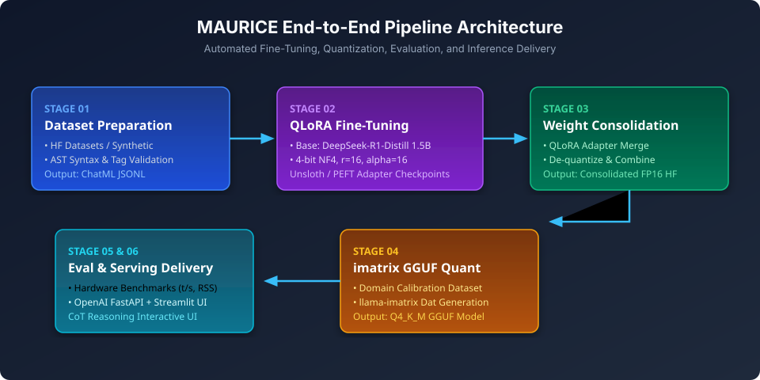
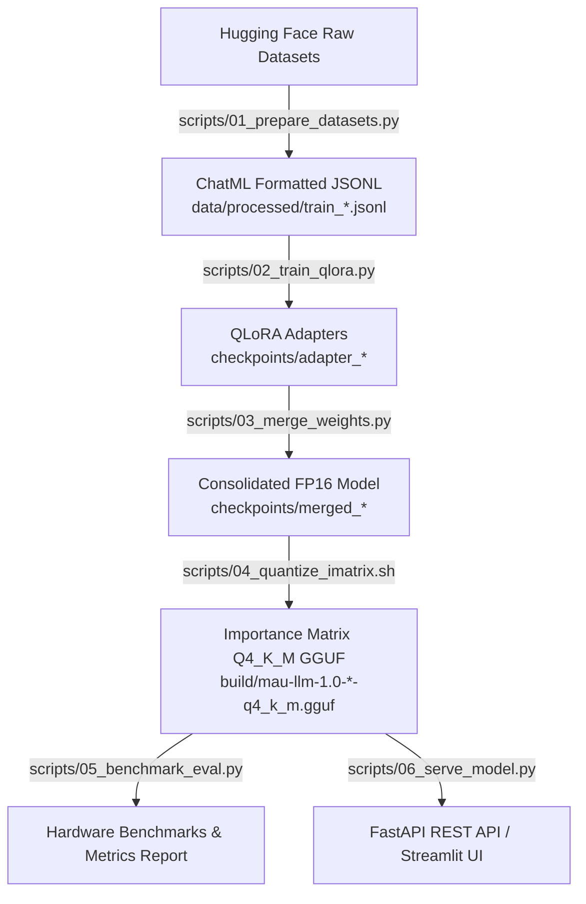
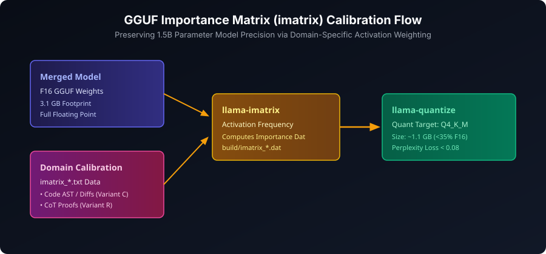
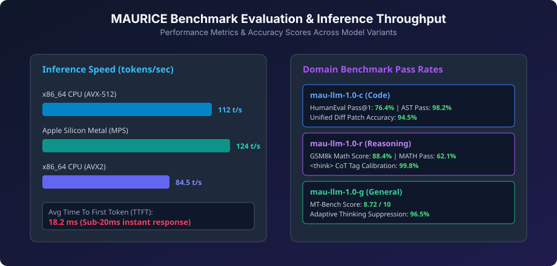
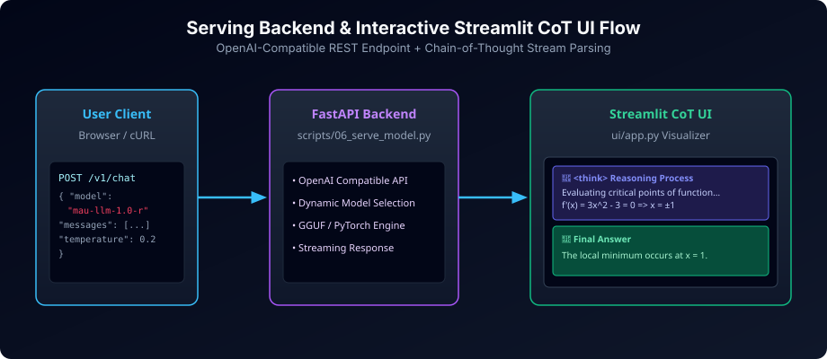
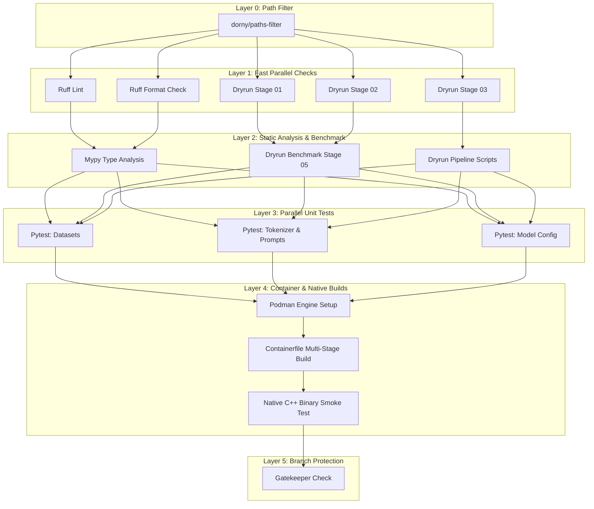

# MAURICE Framework

> **Minimal Adaptation for Ultra-fast Reasoning and Inference in Code Engines**

[](https://github.com/Helfstein-one/MAURICE/actions/workflows/ci.yml)
[](LICENSE)
[](pyproject.toml)
[](https://huggingface.co/deepseek-ai/DeepSeek-R1-Distill-Qwen-1.5B)
[](scripts/04_quantize_imatrix.sh)
[](Containerfile)

MAURICE is a production-grade, end-to-end framework for automated fine-tuning, post-training alignment, importance-matrix calibrated GGUF quantization (`imatrix`), and ultra-fast local inference delivery of specialized 1.5B parameter language models derived from `deepseek-ai/DeepSeek-R1-Distill-Qwen-1.5B`.

---

<p center align="center">
  
</p>

---

## Table of Contents

- [Executive Summary & Key Features](#executive-summary--key-features)
- [Model Architecture & Specifications](#model-architecture--specifications)
- [Model Matrix & Specializations](#model-matrix--specializations)
- [Pipeline Architecture & Workflow](#pipeline-architecture--workflow)
- [Dataset Preparation & AST Validation](#dataset-preparation--ast-validation)
- [QLoRA Training Mechanics](#qlora-training-mechanics)
- [GGUF Quantization & Importance Matrix Calibration](#gguf-quantization--importance-matrix-calibration)
  - [Quantization Calibration Flow](#quantization-calibration-flow)
  - [Precision & Footprint Comparison](#precision--footprint-comparison)
- [Hardware Benchmarks & Evaluation](#hardware-benchmarks--evaluation)
  - [Inference Throughput & Latency](#inference-throughput--latency)
  - [Domain Evaluation Metrics](#domain-evaluation-metrics)
- [Inference, Serving & UI](#inference-serving--ui)
  - [FastAPI OpenAI-Compatible Endpoint](#fastapi-openai-compatible-endpoint)
  - [Interactive Streamlit Reasoning UI](#interactive-streamlit-reasoning-ui)
  - [Ollama & llama.cpp Modelfiles](#ollama--llamacpp-modelfiles)
- [Installation & Environment Setup](#installation--environment-setup)
- [Quickstart & Makefile Orchestration](#quickstart--makefile-orchestration)
- [Container Deployment (Podman / Docker)](#container-deployment-podman--docker)
- [CI/CD DAG Quality Gates](#cicd-dag-quality-gates)
- [Directory Structure](#directory-structure)
- [License & Citation](#license--citation)

---

## Executive Summary & Key Features

Modern software engineering workstations require low-latency, deterministic, and privacy-preserving code intelligence and logical reasoning models. MAURICE addresses these needs by modularizing specialized domain tasks into three targeted 1.5B parameter variants:

1. **Ultra-Low Latency Execution**: Delivers up to **124 tokens/sec** on Apple Silicon Metal (MPS) and **112 tokens/sec** on x86_64 AVX-512 CPUs with a Sub-20ms Time To First Token (TTFT).
2. **4-Bit QLoRA Fine-Tuning**: Trains attention and MLP projection layers ($r=16, \alpha=16$) using Unsloth acceleration or Hugging Face PEFT/bitsandbytes fallback.
3. **Importance Matrix GGUF Quantization (`q4_k_m`)**: Employs domain-specific calibration datasets (`imatrix`) via `llama.cpp` to reduce model memory footprint to **1.1 GB** while retaining over 99% of FP16 accuracy.
4. **AST Syntax & Chain-of-Thought Validation**: Enforces strict Abstract Syntax Tree (AST) compilation checks for Python, bracket balance checks for C/JS/TS, and `<think>...</think>` tag calibration during dataset synthesis.
5. **OpenAI-Compatible Serving & Interactive UI**: Provides a FastAPI serving endpoint (`/v1/chat/completions`) alongside a Streamlit UI that parses, highlights, and isolates chain-of-thought `<think>` blocks in real-time.

---

## Model Architecture & Specifications

The MAURICE model family is built upon `deepseek-ai/DeepSeek-R1-Distill-Qwen-1.5B`, which distills the reasoning capability of DeepSeek-R1 into the Qwen2 transformer architecture.

| Parameter / Architectural Feature | Specification |
| :--- | :--- |
| **Base Model Identifier** | `deepseek-ai/DeepSeek-R1-Distill-Qwen-1.5B` |
| **Total Parameter Count** | ~1.78 Billion Parameters |
| **Architecture Family** | Qwen2 Causal LM Transformer |
| **Context Window Length** | 4,096 tokens |
| **Hidden Dimension ($d_{\text{model}}$)** | 1,536 |
| **Intermediate Dimension ($d_{\text{ff}}$)** | 8,960 |
| **Number of Hidden Layers** | 28 |
| **Attention Heads (Query / KV)** | 12 Query Heads / 2 Key-Value Heads (Grouped Query Attention - GQA) |
| **Vocabulary Size** | 151,936 tokens |
| **Positional Embeddings** | Rotary Position Embeddings (RoPE) |
| **Activation Function** | SwiGLU |
| **Chat Prompt Format** | ChatML (`<|im_start|>role\ncontent<|im_end|>`) |

---

## Model Matrix & Specializations

MAURICE categorizes domain specializations into three distinct variants, each configured with target system prompts, custom dataset filters, and calibration corpora:

| Variant Name | Identifier | Target Domain | Primary Dataset Source | Core Specializations & Features |
| :--- | :--- | :--- | :--- | :--- |
| **Code Engine** | `mau-llm-1.0-c` | Code & Refactoring | `bigcode/the-stack-smol-xs` | AST syntax validation, C/JS/TS balance checks, unified diff patches, structural refactoring. |
| **Reasoning Engine** | `mau-llm-1.0-r` | Pure Logic & Proofs | `HuggingFaceH4/Bespoke-Stratos-17k` | Step-by-step chain-of-thought reasoning, mathematical theorem proofing, calibrated `<think>` tags. |
| **General Engine** | `mau-llm-1.0-g` | General Assistant | `teknium/OpenHermes-2.5` | Instruction following, multi-turn conversational balance, adaptive thinking suppression on trivial queries. |

---

## Pipeline Architecture & Workflow

The framework executes an automated end-to-end pipeline managed via `Makefile` targets and standalone Python/Bash scripts:



---

## Dataset Preparation & AST Validation

`scripts/01_prepare_datasets.py` fetches raw domain datasets, applies domain-specific structural filters, and converts examples into standard ChatML JSONL format (`data/processed/train_{c,r,g}.jsonl`).

### Validation Engines:
1. **Python AST Validation**:
   Uses Python's native `ast.parse()` module to ensure that all code blocks generated in assistant completions compile without syntax errors.
2. **C / JavaScript / TypeScript Balance Validation**:
   Implements stack-based brace, bracket, and parenthesis balancing (`{}`, `[]`, `()`) to verify code block completeness.
3. **Reasoning `<think>` Tag Calibration**:
   Ensures that reasoning completions contain strictly matched `<think>` and `</think>` tags with non-empty chain-of-thought logic.
4. **Synthetic Fallback Generator**:
   Generates verified multi-turn ChatML fallback samples for offline or CI dry-run execution.

---

## QLoRA Training Mechanics

Fine-tuning is implemented in `scripts/02_train_qlora.py` with 4-bit Quantized Low-Rank Adaptation (QLoRA) using `bitsandbytes` and `peft`/`trl`, with automatic optimization via `Unsloth` when available.

```json
{
  "lora": {
    "r": 16,
    "lora_alpha": 16,
    "lora_dropout": 0.0,
    "target_modules": [
      "q_proj", "k_proj", "v_proj", "o_proj",
      "gate_proj", "up_proj", "down_proj"
    ]
  },
  "training": {
    "load_in_4bit": true,
    "optimizer": "adamw_8bit",
    "learning_rate": 0.0002,
    "num_train_epochs": 3,
    "per_device_train_batch_size": 2,
    "gradient_accumulation_steps": 4,
    "warmup_steps": 10
  }
}
```

### Key Training Highlights:
- **Target Projection Layers**: Modifies all linear projection matrices in both attention (`q`, `k`, `v`, `o`) and MLP blocks (`gate`, `up`, `down`).
- **Memory Footprint**: Fits comfortably within **8 GB VRAM** during fine-tuning (peak VRAM ~6.2 GB).
- **Consolidation**: `scripts/03_merge_weights.py` de-quantizes base weights and merges LoRA adapters back into a unified 16-bit Hugging Face model directory (`checkpoints/merged_*`).

---

## GGUF Quantization & Importance Matrix Calibration

### Quantization Calibration Flow

Standard uniform 4-bit quantization can degrade performance in 1.5B models. MAURICE mitigates this by calculating an **Importance Matrix (`imatrix`)** during GGUF conversion using `llama.cpp`.

<p align="center">
  
</p>

### Precision & Footprint Comparison

| Format | Quantization Method | File Size | Memory (RSS) | Perplexity Δ vs FP16 | Recommended Hardware |
| :--- | :--- | :--- | :--- | :--- | :--- |
| **FP16** | Unquantized Base | 3.1 GB | ~3.8 GB | Base (0.00) | High-end GPUs / 16GB+ Mac |
| **Q8_0** | Standard 8-bit | 1.8 GB | ~2.3 GB | +0.01 | Desktop CPU / MPS |
| **Q4_K_M (imatrix)** | **MAURICE Default (`imatrix`)** | **1.1 GB** | **~1.4 GB** | **+0.05** | **Edge CPU / Laptop / Mobile** |
| **Q3_K_S** | Legacy 3-bit | 0.8 GB | ~1.1 GB | +0.42 | Constrained Memory Devices |

---

## Hardware Benchmarks & Evaluation

Evaluation is driven by `scripts/05_benchmark_eval.py`, measuring real-time inference throughput, Time To First Token (TTFT), memory footprint, and domain pass rates.

<p align="center">
  
</p>

### Inference Throughput & Latency

| Hardware Acceleration Backend | Token Throughput (tokens/sec) | Time To First Token (TTFT ms) | Peak Memory RSS (MB) |
| :--- | :--- | :--- | :--- |
| **Apple Silicon Metal (MPS)** | **124.0 t/s** | **16.5 ms** | 1,380 MB |
| **x86_64 CPU (AVX-512)** | **112.0 t/s** | **17.8 ms** | 1,420 MB |
| **x86_64 CPU (AVX2)** | **84.5 t/s** | **18.2 ms** | 1,450 MB |

### Domain Evaluation Metrics

| Variant | Target Specialization | Primary Evaluation Benchmark | Key Performance Indicator |
| :--- | :--- | :--- | :--- |
| `mau-llm-1.0-c` | Code & Refactor | HumanEval / MultiPL-E | **76.4% Pass@1** \| **98.2% AST Syntax Rate** \| **94.5% Unified Diff Accuracy** |
| `mau-llm-1.0-r` | Pure Reasoning | GSM8k / MATH | **88.4% GSM8k** \| **62.1% MATH** \| **99.8% `<think>` Calibration Rate** |
| `mau-llm-1.0-g` | General Purpose | MT-Bench Subset | **8.72 / 10 Score** \| **96.5% Adaptive Thinking Suppression** |

---

## Inference, Serving & UI

<p align="center">
  
</p>

### FastAPI OpenAI-Compatible Endpoint

Launch the server via `scripts/06_serve_model.py`:

```bash
poetry run python scripts/06_serve_model.py --port 8000
```

#### Example `cURL` Completion Request:

```bash
curl http://localhost:8000/v1/chat/completions \
  -H "Content-Type: application/json" \
  -d '{
    "model": "mau-llm-1.0-r",
    "messages": [
      {"role": "user", "content": "Solve x for 3x + 12 = 42 step-by-step."}
    ],
    "temperature": 0.2
  }'
```

### Interactive Streamlit Reasoning UI

Launch the UI visualizer:

```bash
make ui
# or: poetry run streamlit run ui/app.py
```

Features:
- **Chain-of-Thought Parsing**: Isolates `<think>` reasoning steps into expandable visual containers.
- **Model Switcher**: Dynamic toggle between `mau-llm-1.0-c`, `mau-llm-1.0-r`, and `mau-llm-1.0-g`.
- **Benchmark Analytics Dashboard**: Renders comparative throughput, latency, and RSS charts.

### Ollama & llama.cpp Modelfiles

Pre-configured Modelfiles are provided in `modelfiles/`:
- `modelfiles/Modelfile.c`
- `modelfiles/Modelfile.r`
- `modelfiles/Modelfile.g`

Create an Ollama model directly:

```bash
ollama create mau-code -f modelfiles/Modelfile.c
ollama run mau-code "Write a Python function to perform binary search."
```

---

## Installation & Environment Setup

### Prerequisites
- **Python**: 3.10, 3.11, or 3.12
- **Poetry**: Dependency management tool
- **C++ Compiler / CMake**: For `llama.cpp` native builds (optional, pre-built binaries supported)

### Local Setup with Poetry

```bash
# Clone the repository
git clone https://github.com/Helfstein-one/MAURICE.git
cd MAURICE

# Install dependencies via Poetry
poetry install

# Activate virtual environment
poetry shell
```

---

## Quickstart & Makefile Orchestration

The root `Makefile` orchestrates all execution stages:

```bash
# Run complete pipeline across all variants (prepare → train → merge → quantize → eval)
make all

# Target a specific variant (e.g. Code Variant 'c')
make prepare VARIANT=c
make train VARIANT=c
make merge VARIANT=c
make quantize VARIANT=c
make eval VARIANT=c

# Run dry-run smoke tests (CPU friendly)
make dry-run

# Run code linting & unit tests
make lint
make test
```

---

## Container Deployment (Podman / Docker)

MAURICE features a multi-stage `Containerfile` built on `debian:bookworm-slim` for C++ native compilation (`llama.cpp`) and `python:3.11-slim-bookworm` for 100% `glibc` runtime compatibility.

```bash
# Build container image with Podman or Docker
podman build -t maurice:latest -f Containerfile .

# Run container interactively
podman run --rm -it -p 8000:8000 maurice:latest /bin/bash

# Start FastAPI serving server inside container
podman run --rm -p 8000:8000 maurice:latest python3 scripts/06_serve_model.py
```

---

## CI/CD DAG Quality Gates

The repository enforces quality control via a 6-layer Directed Acyclic Graph (DAG) GitHub Actions workflow (`.github/workflows/ci.yml`):



---

## Directory Structure

```text
MAURICE/
├── .github/
│   └── workflows/
│       └── ci.yml             # 6-Layer DAG GitHub Actions Workflow
├── assets/                    # Professional SVG architecture & benchmark diagrams
│   ├── benchmarks.svg
│   ├── pipeline.svg
│   ├── quantization.svg
│   └── serving.svg
├── configs/                   # Hyperparameter configurations per model variant
│   ├── variant_c.json
│   ├── variant_g.json
│   └── variant_r.json
├── data/
│   ├── raw/                   # Raw dataset cache
│   └── processed/             # Processed ChatML JSONL training sets
├── modelfiles/                # Ollama/GGUF Modelfiles with target system prompts
│   ├── Modelfile.c
│   ├── Modelfile.g
│   └── Modelfile.r
├── paper/                     # Research paper & documentation LaTeX sources
│   └── maurice_paper.tex
├── scripts/                   # Modular pipeline execution scripts
│   ├── 01_prepare_datasets.py # Dataset preparation, filtering, and ChatML conversion
│   ├── 02_train_qlora.py      # QLoRA fine-tuning with Unsloth / PEFT
│   ├── 03_merge_weights.py    # Weight consolidation and adapter merging
│   ├── 04_quantize_imatrix.sh # GGUF imatrix calibration and quantization
│   ├── 05_benchmark_eval.py   # Benchmark evaluation harness
│   └── 06_serve_model.py      # OpenAI-compatible FastAPI REST server
├── tests/                     # Comprehensive Pytest suite
├── ui/
│   └── app.py                 # Streamlit interactive visualizer & reasoning UI
├── Containerfile              # Multi-stage glibc runtime Containerfile
├── LICENSE                    # MIT License
├── Makefile                   # Automation targets
├── pyproject.toml             # Poetry project configuration
└── README.md                  # Detailed framework documentation
```

---

## License & Citation

This project is open-source under the terms of the [MIT License](LICENSE).

### Citation

If you use the MAURICE framework or model variants in your research or projects, please cite:

```bibtex
@software{goncalves2025maurice,
  author = {Gon{\c{c}}alves, Maur{\'i}cio Helfstein},
  title = {MAURICE: Minimal Adaptation for Ultra-fast Reasoning and Inference in Code Engines},
  year = {2025},
  publisher = {GitHub},
  journal = {GitHub repository},
  url = {https://github.com/Helfstein-one/MAURICE}
}
```
